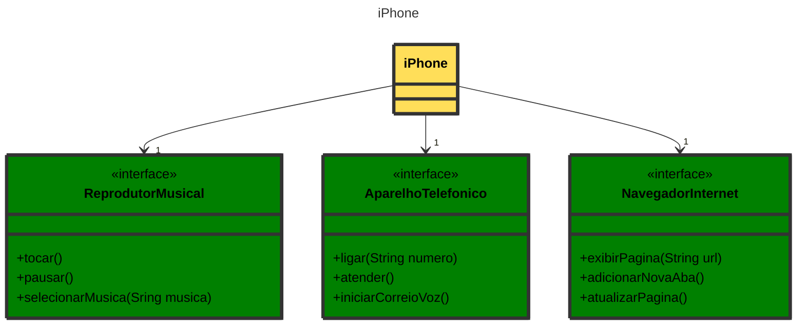

# DESAFIO DIO - MODELAGEM E DIAGRAMAÇÃO DE UM COMPONENTE IPHONE 💻

Olá! É um prazer descrever nos mínimos detalhes esse *README* para você. Meu nome é [Miguel Alves Barbosa](https://github.com/MiguelitoJLY). Sou desenvolver back-end Java e estou atendendo ao **desafio** oferecido pela [DIO](https://www.dio.me/).

## Proposta do Desafio 🎯

O desafio era modelar e desenvolver um `diagrama UML` para representar o componente [iPhone](https://www.apple.com/br/iphone/), sendo este o primeiro que foi apresentando por [Steve Jobs](https://www.ebiografia.com/steve_jobs/), o criador da tão famosa [Apple](https://www.apple.com/).
 
Foi oferecido ao desafiante o [vídeo de apresentação do iPhone](https://www.youtube.com/watch?v=9ou608QQRq8&t=3163s&ab_channel=TuchilaRino), que é recomendado para ***todo*** desenvolvedor assistir.
  
Nesse desafio, o desenvolvedor deveria abordar os três elementos principal que Jobs apresentou no anúncio do iPhone: `Reprodutor Musical`, `Aparelho Telefônico` e `Navegador na Internet`. 
Vale mencionar que a ideia principal é apresentar o **ALGORITMO** neste repositório! Não tem, de fato, um iPhone por aqui 😆  
Segue o `diagrama UML`, feito através do [Mermaid](https://mermaid.js.org/):

Era **OPCIONAL** o desenvolvimento da implementação deste diagrama nas classes Java, mas o mesmo foi feito por mim neste desafio!
